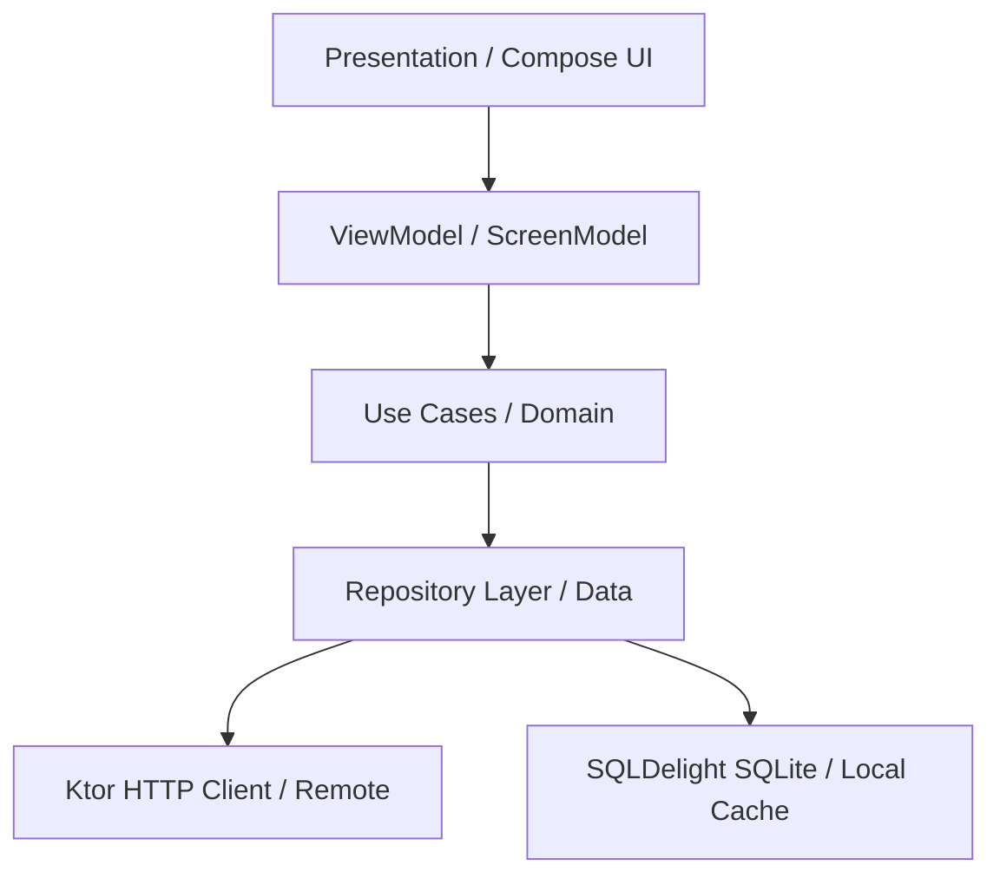

# ZeeroStock Mobile Terminal (KMP)

ZeeroStock , Offline First Mobile App (Compose Multiplatform)

---

###  Project Resources & Repositories
- **Mobile App Repository**: [github.com/yeshuwahane/zeero](https://github.com/yeshuwahane/zeero)
- **Backend API Repository**: [github.com/yeshuwahane/zeeroapi](https://github.com/yeshuwahane/zeeroapi)
- ** Android Build**: [Download ZeeroStock APK (Mock Link)](https://github.com/yeshuwahane/zeero/releases/download/v1.0.0/zeerostock-release.apk)

---

- **Backend Integration**: Communicates with Ktor API hosted on Railway at `https://zeeroapi-production.up.railway.app`
- **Database Caching**: Persists inventory, bids, and user settings locally using SQLDelight SQLite.

> [!IMPORTANT]
> **Railway Cold Starts**: The Ktor backend server is hosted on Railway's hobby tier and automatically sleeps after periods of inactivity. If the server is in an idle state, the initial request (such as logging in or loading products) may experience a delay of 20–30 seconds. Subsequent operations are near-instant.

---

##  Architecture & Flow

The codebase is split into three Clean Architecture layers inside the `shared` module:



1. **Presentation Layer**: Handles Compose Multiplatform rendering. Uses the **MVI (Model-View-Intent)** design pattern where screens emit `Intents` to `ViewModels` (Voyager `ScreenModel`), and the UI reactively renders updates based on a single `UiState` StateFlow.
2. **Domain Layer**: Holds business logic. Includes domain models (e.g., `Product`, `User`) and reusable `UseCases` (e.g., `PlaceBidUseCase`, `UpdateProductUseCase`).
3. **Data Layer**: Coordinates data retrieval. Employs an **Offline-First caching strategy** using `ProductRepositoryImpl` and `UserRepositoryImpl`. API calls cache results locally in SQLite.

---

##  Tech Stack & Libraries

- **Compose Multiplatform**: Shared declarative UI for Android and iOS.
- **Voyager**: Lifecycle-aware multiplatform navigation, `ScreenModel` state retention, and screen transitions.
- **Ktor Client**: HTTP engine configured with JSON Content Negotiation and logging plugins.
- **SQLDelight**: Type-safe SQLite database generator for multiplatform local caching.
- **Koin**: Dependency injection framework defining bindings in `AppModule`, `CommonModule`, and `PlatformModule`.
- **Napier**: Logging framework for cross-platform debugging.

---

##  Project Structure

```bash
├── androidApp/          # Android entry point and launcher setup
├── iosApp/              # iOS entry point (Xcode SwiftUI project wrapper)
└── shared/              # Core Shared Kotlin Multiplatform module
    └── src/
        ├── commonMain/  # Shared core module code
        │   └── kotlin/com/yeshuwahane/zeero/
        │       ├── data/          # Repositories, DB access, and safe API wrappers
        │       ├── di/            # Koin Modules definitions
        │       ├── domain/        # Domain Models and UseCases
        │       └── presentation/  # Screens, ViewModels (MVI), and Shared Components
        ├── androidMain/ # Android platform integrations (SQLite Driver)
        └── iosMain/     # iOS platform integrations (Darwin HTTP Engine, SQLite Driver)
```

---

##  Getting Started

### Prerequisites
- macOS machine with **Xcode** (for iOS builds)
- **Android Studio**
- JDK 17+

### Running Android
```bash
./gradlew :androidApp:installDebug
```

### Running iOS
1. Open the `./iosApp` folder in Xcode.
2. Select your simulator or physical target.
3. Click **Product > Run** (`Cmd + R`).

.